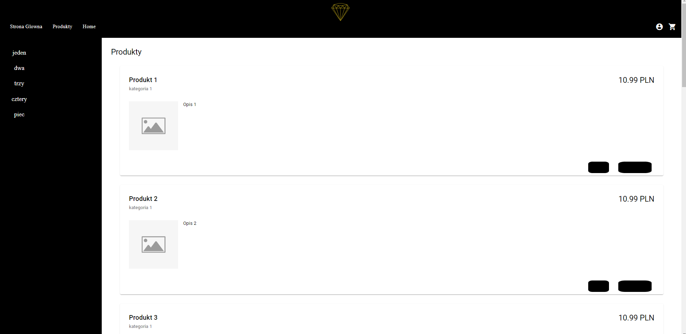

# Dokumentacja Aplikacji TavelloWeB
 
> Aplikacja TravelloWeb stworzona za pomocą technologi .NET wraz z wykorzystaniem języka C#. To narzędzie służy do rejestrowania, logowania, dodawania ogłoszeń wycieczek podróży, przeglądania ogłoszeń i rezerwacji biletów.
 
## Spis Treści
* [Informacje Ogólne](#informacje-ogólne)
* [Technologie Użyte](#technologie-użyte)
* [Funkcjonalności](#funkcjonalności)
* [Zrzuty Ekranu](#zrzuty-ekranu)
* [Instalacja](#instalacja)
* [Jak Korzystać](#jak-korzystać)
* [Status Projektu](#status-projektu)
* [Plan Rozwoju](#plan-rozwoju)
* [Twórcy](#twórcy)
* [Kontakt](#kontakt)
 
## Informacje Ogólne
- Celem aplikacji jest ułatwienie procesu kupna biletów wycieczek intuicyjny interfejs użytkownika.
- Umożliwia użytkownikom rejestrację, logowanie oraz zarządzanie ogłoszeniami o wynajmie wycieczkach.
- Aplikacja zawiera funkcjonalności takie jak dodawanie, edytowanie, przeglądanie i kupno wycieczek.
 
## Technologie Użyte
- C#
- .NET
- MySQL
 
## Funkcjonalności
- Rejestracja, logowanie i wylogowywanie użytkowników.
- Dodawanie ogłoszeń o wycieczkach, w tym: nazwa, miasto, zdjęcia, opis, liczba biletów, przewodnik.
- Edycja ogłoszeń.
- Przeglądanie i wyszukiwanie ogłoszeń na stronie głównej.
- Kupno wycieczek.
- Podgląd koszyka zakupów w widoku konta użytkownika.
 
## Zrzuty Ekranu

**Strona główna**

**Logowanie**

**Lista Wycieczek**

**Dane Wycieczki**

**Koszyk Produktów**

**Lista Przewodników**

**Edycja Ogłoszenia Wycieczki**

**Edycja Danych Przewodnika**

 
## Instalacja
Aby uruchomić projekt lokalnie:
1. W terminalu wpisz `cd api` a następnie `node index.js`.
2. W nowym terminalu wpisz `cd klient` a następnie `yarn dev`.
3. Otwórz przeglądarkę i przejdź pod adres hosta, który się wyświetli.
4. Importuj kolekcje bazy danych z folderu `CarRental` (`bookings`, `cars`, `logowanies`, `users`) do MongoDB.
 
## Jak Korzystać
- Zarejestruj się i zaloguj do aplikacji, aby korzystać z pełnej funkcjonalności.
- Dodawaj, edytuj i przeglądaj ogłoszenia wycieczek.
- Dokonuj zakupu wybranych wycieczek.
 
## Status Projektu
Projekt jest w trakcie rozwoju.
 
## Plan Rozwoju
- Wprowadzenie pełnej funkcjonalnościu zakupu wycieczek.
- Poprawa i zmiana wyglądu interfejsu użytkownika.
 
## Twórca
- Projekt stworzony przez [@Roshuu](https://github.com/Roshuu).
 
## Kontakt
- W przypadku pytań lub sugestii, proszę kontaktować się z twórcami projektu.
